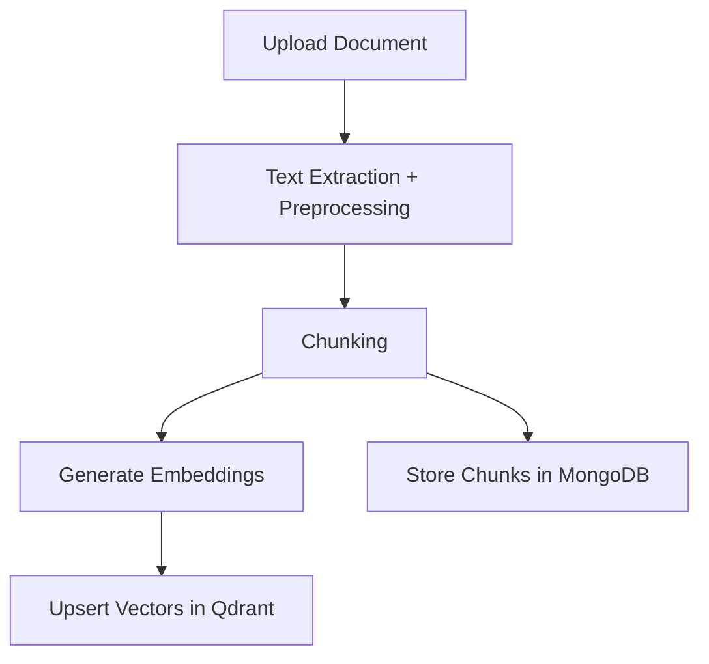
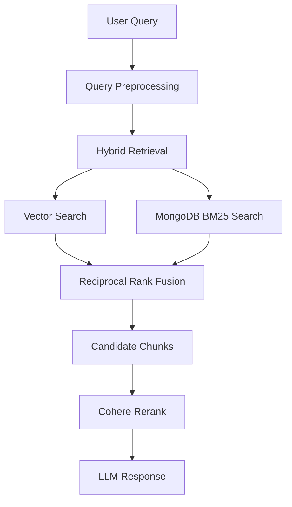

<h1 align="center">smartdoc.ai</h1>

smartdoc.ai is a **Retrieval-Augmented Generation (RAG) system** that enables users to upload documents and query them through a conversational interface. 
The system retrieves relevant document context and generates grounded responses while maintaining **multi-turn chat history**.

## Document Ingestion Pipeline

## Retrieval Pipeline

## Tech Stack

| Layer | Technology |
|------|-------------|
| Backend | Java, Spring Boot |
| Database | MongoDB |
| Vector Database | Qdrant |
| Cache | Redis |
| Embedding Model | BGE (BAAI General Embedding) via HuggingFace |
| LLM | SmolLM3B |
| Reranking | Cohere Reranker |
| Document Processing | Apache PDFBox, Apache POI |
| Architecture |Port and Adapter (Hexagonal Architecture) |
